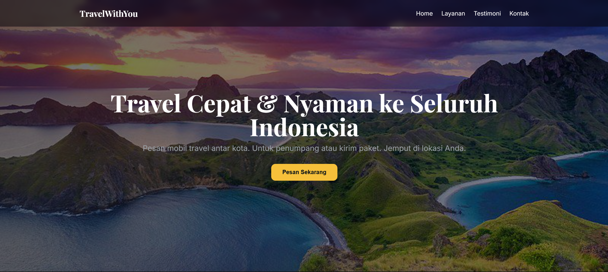
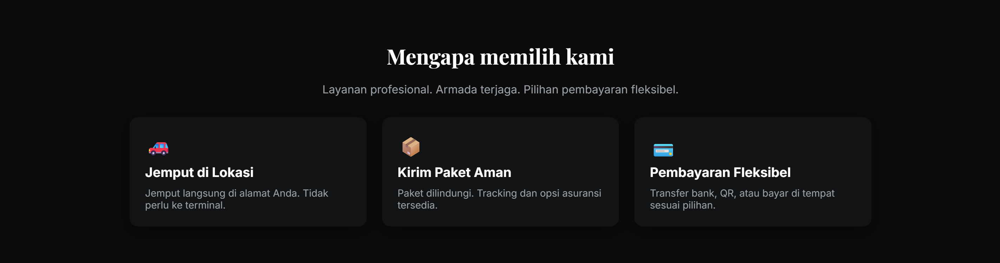
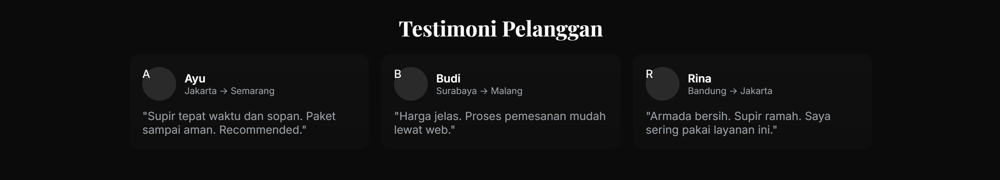
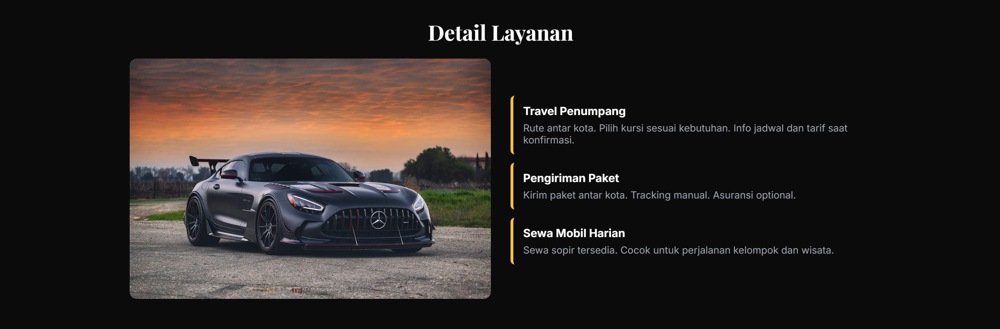
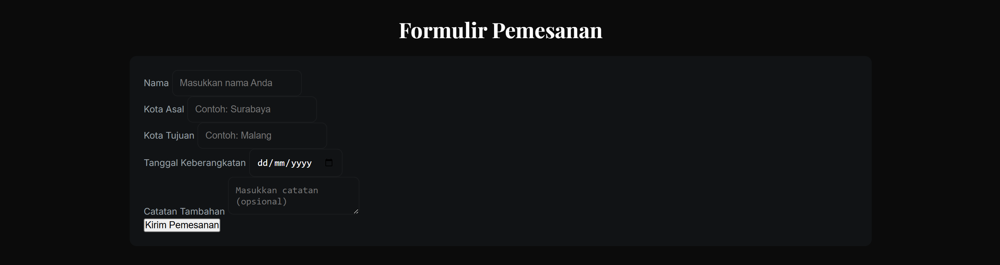

# ETS Pemrograman Web A Brilian (5025241213)
## Membuat Landing Page
Link YT : 

Dalam ETS kali ini, disuruh untuk membuat Landing Page Travel yang harus memuat fitur-fitur berikut : 
1. Header / Hero Section
2. Benefit Section
3. Social Proof / Testimoni
4. Detail Produk / Penjelasan Layanan
5. Offer / Promo (opsional)
6. Formulir / Lead Capture
7. FAQ (Frequently Asked Questions)
8. Footer

## Hasil Landing Page 
1. Header / Hero Section
   

2. Benefit Section

3. Social Proof / Testimoni

4. Detail Produk / Penjelasan Layanan

5. Offer / Promo (opsional)

6. Formulir / Lead Capture

7. FAQ (Frequently Asked Questions)

8. Footer

